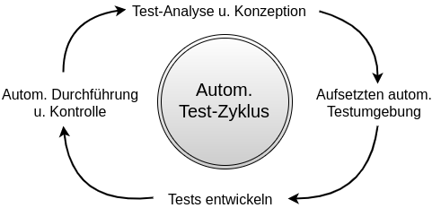
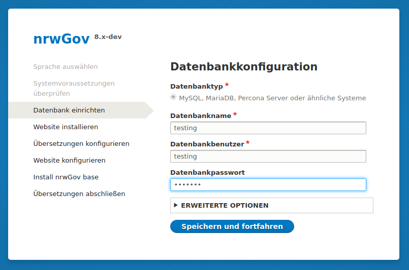
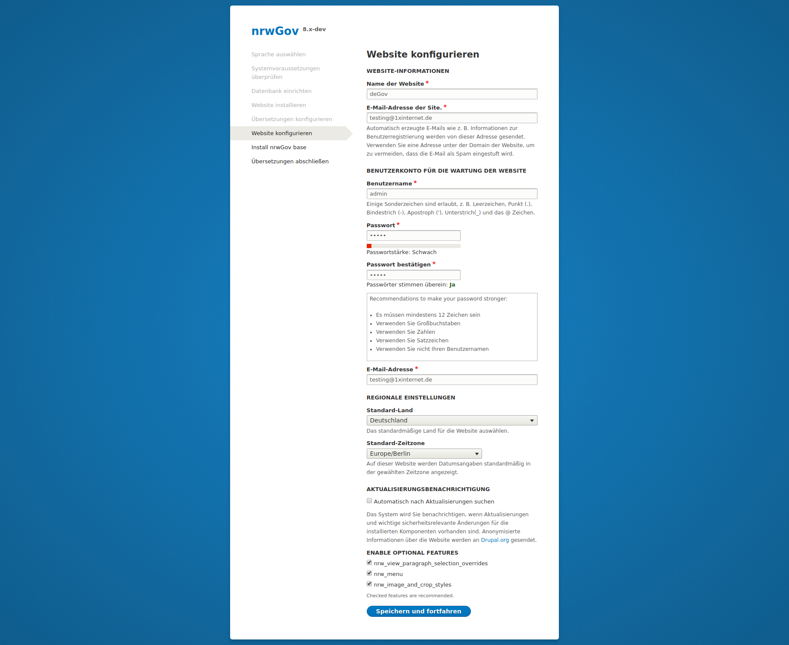
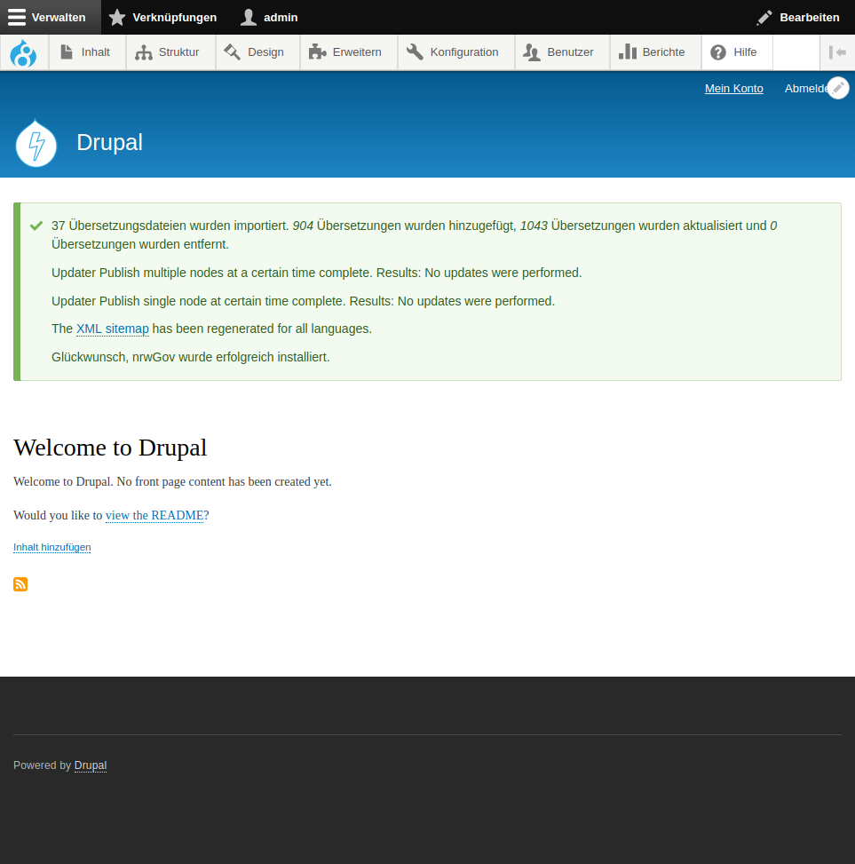
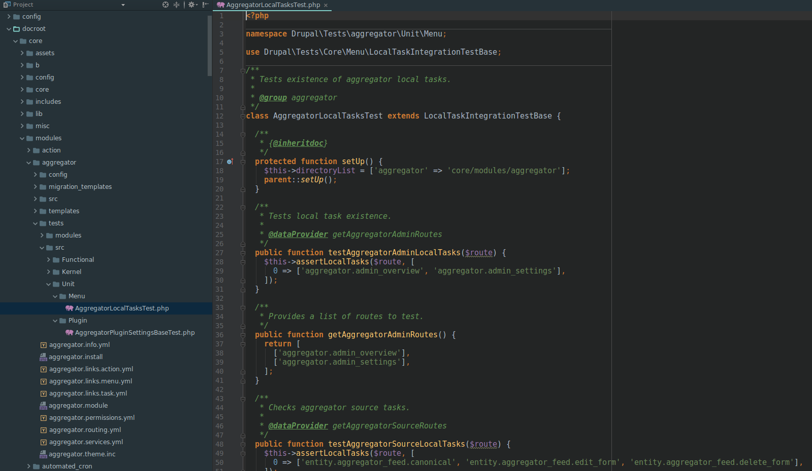
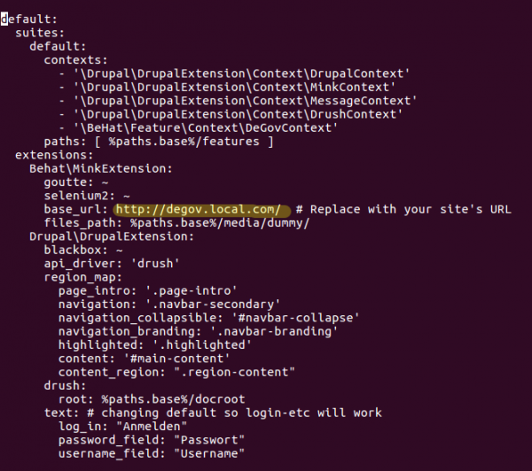
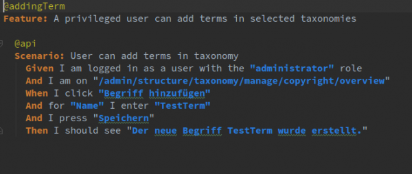
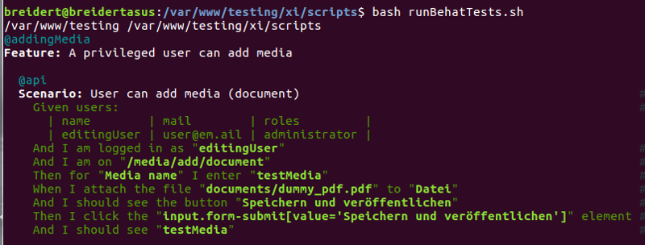
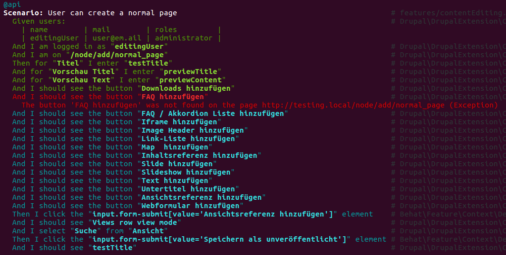

Automatisches Testen von deGov
==============================

[TOC]

Allgemeines
-----------
Vorliegende Dokumentation beschreibt das Testen von Drupalanwendungen mit Unit-Tests, Behat-Tests sowie graphischen Tests-Tools. Der Anwendungsfall für die Dokumentation ist das automatisierte Testen der Drupal-Distribution deGov.

Folgende Dokumentation bezieht sich auf die Version 1.4.0 von deGov. Die Dokumentation ist aber auch für nachfolgende Versionen von deGov gültig. Im Beispiel wird die Webseite für das MIK installiert.

Testen von Webanwendungen
-------------------------
Die vollständige Prüfung von Webanwendung vor dem Einspielen in die Produktivumgebung kann helfen, Probleme zu erkennen und zu lösen, bevor diese öffentlich sichtbar werden.

Aus diesem Grund sollten das Testen von Webanwendungen ein fixer Bestandteil des Deployments sein.

Im besten Fall wird das Testen im Rahmen des Deployments automatisiert durchgeführt. Automatisierte Tests werden durch per Sourcecode beschriebene Testsszenarios durchgeführt.

Eine Webanwendung kann auch durch automatisierte Tests nicht vollständig getestet werden, weil dadurch der Aufwand, die Tests zu erstellen, sowie die Durchführung der Tests sehr groß werden würde.

Statt dessen muss zwischen dem Aufwand, die Tests zu erstellen, und der Abdeckung der Funktionalität durch Tests abgewogen werden. Das Hauptziel ist so viel Prüfungsaufwand wie möglich zu automatisieren und so wenig bzw. so spezifisch wie möglich manuell zu testen.

Wenn die manuelle Prüfung einen hohen Prozentsatz des Aufwandes bei der Erstellung und des Ausrollens neuer Funktionen darstellt, sollte auf jeden Fall automatisch getestet werden. Ebenso verhält es sich, wenn testenden Funktionen im Fehlerfall zu hohem wirtschaftlichen Schaden führen können.

Wenn automatische Tests aufgesetzt sind, sollten sich diese nahtlos in den Entwicklungs- und Deploymentvorgang integrieren. Neben der Ausführung der Tests und der Kontrolle der Ergebnisse, müssen Tests auch laufend weiterentwickelt werden, um die ursprüngliche Zielsetzung des Testens auch nach Weiterentwicklung der Web-Applikation zu gewährleisten.

Setup deGov
-----------
Zunächst muss deGov installiert werden. Dazu wird das Repository des Projektes MIK geklont und der Tag 1.4.0 ausgecheckt und die Installation mit Composer ausgeführt.

    $ git clone git@bitbucket.org:publicplan/degov_nrw_mik_ressort.git .
    Cloning into '.'...
    remote: Counting objects: 17437, done.
    remote: Compressing objects: 100% (8420/8420), done.
    remote: Total 17437 (delta 9211), reused 14342 (delta 7771)
    Receiving objects: 100% (17437/17437), 6.93 MiB | 3.47 MiB/s, done.
    Resolving deltas: 100% (9211/9211), done.
    Checking connectivity... done.
    
    $ git fetch --tags
    $ git tag
    1.0.0
    ...
    1.4.0
    
    $ git checkout 1.4.0 
    Note: checking out '1.4.0'.
    You are in 'detached HEAD' state. You can look around, make experimental
    changes and commit them, and you can discard any commits you make in this
    state without impacting any branches by performing another checkout.
    If you want to create a new branch to retain commits you create, you may
    do so (now or later) by using -b with the checkout command again. Example:
    git checkout -b <new-branch-name>
    HEAD is now at f6a9f95... Tag release 1.4.0
    
    $ composer install

Anschliessend kann die Webseite über den Browser installiert werden.

Nach Installation von deGov, muss das gewünschte Theme installiert (im Beispiel NRWGov) und die gewünschten deGov Module installiert werden (im Beispiel alle deGov Module).

Danach kann Inhalt eingeben werden. Beispielhaft wurde eine Startseite erstellt.

Testing des Projekt MIK
-----------------------
Um das deGov-Projekt MIK zu testen sollten folgende Testarten durchgeführt werden:

- Unit Testing (PHPunit)
- Behavioral Testing (Behat)
- Visual Regression Testing

Per Unit Testing werden prozedurale Abläufe in Programmschnipseln getestet. Diese Arten von Tests werden vornehmlich in den Kern-Modulen von Drupal eingesetzt.

Auf höheren Implementierungsebenen werden hauptsächlich bestehende Kern-Funktionen erweitert oder Konfigurationen für Kernfunktionen angelegt. Auf dieser Ebene werden Verhaltenstests durchgeführt (Behavioral Testing).

Auf der Anwenderebene (z.B. Projektmanager, QS-Mitarbeiter, Kunden) können zusätzlich noch visuelles Testen durchgeführt werden.

Um möglichst effizient eine gute Testabdeckung zu erzielen, wäre es beim Projekt MIK sinnvoll vor jedem Deployment, die in den Kernmodulen von Drupal integrierten Tests durchzuführen. Die Wahrscheinlichkeit hier Fehler zu finden, durch die die Lauffähigkeit der Applikation beeinträchtigt wird ist gering, da deGov auf einem bereits getestete Kern (Drupal) sowie einer bereits getesteten Distribution (Lightning) aufsetzt. Dennoch können uns sollten die Tests durchgeführt werden.

Bei den Modulen für deGov handelt es sich hauptsächlich um Konfigurationsmodule. Aus diesem Grund wäre es sinnvoll hier die wichtigsten Funktionen des Projekt MIK systematisch durch Verhaltenstests zu testen.
Das visuelle Testen kann automatisiert werden, die Konfiguration solcher Tests ist jedoch relativ aufwendig, da genau festgelegt werden muss, welche Bereche im Test veränderlich sein dürfen (z.B. neuste Artikel) und welche gleich sein sollen. Anstelle von automatisierten visuellen Tests würden wir daher halb-automatisiertes Testen empfehlen. Hierbei haben die Verantwortlichen Tools zur Verfügung um schnell zu testen und visuelle Abweichungen zu überprüfen.

Alle Testmethoden sind weiter unten im Detail beschrieben und beispielhafte Tests werden durchgeführt.

Unit Testing
------------
Die Sourcen von Unit-Tests liegen immer direkt bei den zu testenden Programmteilen. Hierbei folgen die Unit-Tests in Drupal einem bestimmten Ordner Struktur sowie einer Konvention für Klassennamen und Namespaces. Hierbei folgen Kernmodule immer folgendem Schema:

- Directory: `core/modules/[modulename]/tests/src/Unit`
- Namespace: `Drupal\Tests\[modulename]\Unit`

Z.B. liegen die Unit-Tests für das Kernmodul Aggregator im Pfad `<project--oot>core/modules/aggregator/tests/src/Unit/...`

Im Detail kann die Konfiguration von Tests in Drupal unter https://www.drupal.org/node/2116043 nachgelesen werden. Weiterhin ist die allgemeine Dokumentation von PHPUnit hilfreich: https://phpunit.de/manual/3.7/en/writing-tests-for-phpunit.html#writing-tests-for-phpunit.data-providers.

Unit-Tests erstellen
--------------------
Um Unit-Tests für Drupal-Module zu erstellen, ist es am einfachsten ein Grundgerüst für Tests mit Drupal-Console zu generieren. Durch folgende interaktiven Aufruf kann ein Modul mit Testklassen erzeugt werden:

    drupal generate:module --test

Die vollständige Dokumentation für `drupal generate:module` kann unter https://docs.drupalconsole.com/en/commands/generate-module.html nachgelesen werden.

Unit-Tests ausführen
--------------------
Um das Ausführen von Tests zu vereinfachen, wurde ein Skript-Ordner im Repository von MIK erzeugt. Dieser ist unter `<project-root>/xi/testing/unit` zu finden. Unit-Tests werden mit folgendem Kommando ausgeführt:

    $ bash runUnitTests.sh

Unit-Tests erzeugen eine Reihe Ausgaben. Diese können über den Parameter -x zusätzlich in das Verzeichnis `<project-root>/xi/testing/unit/testreports/` geschrieben werden. Um Informationen über die Verwendung des Skripts zu erhalten kann der Parameter -h übergeben werden.

Das Skript setzt voraus, dass die ausführbare Datei phpunit über eine entsprechende Pfadvariable bekannt ist. Sollte dies nicht der Fall sein, muss der Pfad `<project-root>/vendor/phpunit/phpunit/phpunit` hinzugefügt werden.
Das kann in einer Bash-Shell z.B. durch Aufruf von `PATH=<project-root>/vendor/phpunit/phpunit:$PATH` gemacht werden.

Behat Testing
-------------
Um Behat-Tests laufen zu lassen, muss zunächst die URL des Testservers in der Datei `<project-root>/behat.yml` eingegeben werden.

Danach muss Behat in der Wurzel des Projektes initialisiert werden:

    $ bash bin/behat --init

Tests werden im Verzeichnis `<project-root>/features` abgelegt.

Behat-Tests erstellen
---------------------
Behat-Tests werden in einer Programmiersprache namens Gherkin erstellt. Die Syntax ist an die menschliche Sprache angelehnt und kann auch von Nicht-Programmierern gelesen werden. Das Ziel von Gherkin ist auf der einen Seite Tests zu definieren, auf der anderen Seite funktionierende Arbeitsabläufe zu dokumentieren. Die Syntax kann im Detail unter http://docs.behat.org/en/v2.5/guides/1.gherkin.html nachgelesen werden.

Im Folgenden ist ein Beispieltest dargestellt, in dem ein angemeldeter User einen Begriff zu einer Taxonomie hinzufügt.

Im Projekt MIK ist es sinnvoll die in einem Projekt eingesetzte Funktionalität mit Bhat-Tests abzuprüfen.
Z.B. könnte, sofern die Inhaltstypen 'Einfache Seite', 'Pressemeldung' und 'Veranstaltung' installiert sind, mit Behat geprüft werden, ob alle Felder im 'node/add' oder 'node/edit' vollständig zur Verfügung stehen. Weiterhin könnte geprüft werden, ob neue Inhalte der verschiedenen Typen mit Demoinhalten angelegt werden können.
Dasselbe könnte für die konfigurierten Medientypen durchgeführt werden. Per Behat können alle Arbeitsabläufe, die über das User-Interface von Drupal zugänglich sind, durch Tests geprüft werden.
Um den Einstieg zu erleichtern haben wir eine Reihe von Tests im Ordner `<project-root>/features` abgelegt. Folgende Tests wurden erstellt:

 - Test Hinzufügen eines Medienen Elements: `<project-root>/features/addingMedia.feature`
  - Scenario: User can add media (document)
  - Scenario: User can add media (image)
  - Scenario: User can add media (Kontakt hinzufügen)
 - Test Hinzufügen eines Terms: `<project-root>/features/addTerms.feature`
  - Scenario: User can add terms in taxonomy
 - Test Konfigurattion eines Inhaltstypen: `<project-root>/features/configuredContentTypes.feature`
  - Scenario: Preconfigured content-types are present
  - Scenario: Preconfigured fields on normal-pages are present
  - Scenario: All the relevant pragraphs are present
  - Scenario: All the relevant pragraphs fields are present for media_reference
  - Scenario: All pragraphs fields settings are present
  - Scenario: The Cookie-Compliane is configured propperly
  - Scenario: The searchindex has the propper configuration
 - Test Ändern eines Inhalts: `<project-root>/features/contentEditing.feature`
  - Scenario: User can create a normal page
  - Scenario: User can create a press release
  - Scenario: User can create a event
 - Test Änderung eines Layouts: `<project-root>/features/frontendLayout.feature`
  - Scenario: Anonymous user login
  - Scenario: Anonymous user sitemap
 - Test Navigation: `<project-root>/features/mainNavigation.feature`
  - Scenario: User can create a menu link
 - Test Benutzerfunktionen: `<project-root>/features/userActions.feature`
  - Scenario: Create users
  - Scenario: Login as a user created during this scenario
  - Scenario: Verify Administrator access to /admin
  - Scenario: Run cron

Behat-Tests ausführen
---------------------
Um das Ausführen von Tests zu vereinfachen wurde ein Skript-Ordner im Repository von MIK erzeugt. Dieser ist unter `<project-root>/xi/scripts/behat` zu finden. Behat-Tests werden mit folgendem Kommando ausgeführt:

    $ bash runBehatTests.sh

Ohne Parameter führt das Skript alle Tests im Order `<project-root>/features` aus. Um Informationen über die Verwendung des Skripts zu erhalten kann der Parameter -h übergeben werden.
Der Output eines erfolgreichen Tests sieht so aus:

Im Fehlerfall wird die entsprechende Zeile im Test rot angezeigt, nicht ausgeführte Anweisungen werden in blau angezeigt.

Im obigen Beispiel ist der Fehler, dass die Option 'FAQ hinzufügen' entfernt wurde.

Visuelles Testen
----------------
Im Gegensatz zu vorhergehenden Testmethoden geht es beim visuellen Testen (Visual Regression Testing) um das Testen von Layout. Zwar spiegelt sich Funktion auch immer im Layout wider, allerdings sollten Funktionstests mittels Behat durchgeführt werden und Layout-Tests mittels visueller Test-Tools.
Folgende Tools können verwendet werden:

- https://screener.io/
- https://travis-ci.org/
- http://screenster.io/
- https://www.browserstack.com/
- http://shoov.io/
- https://github.com/facebookarchive/huxley (not actively developed anymore)
- https://gemini-testing.github.io/
- https://github.com/DigitalProducts/codeception-module-visualception
- https://github.com/python-needle/needle
- https://github.com/BBC-News/wraith

Aus unserer Sicht ist das letzte Tool 'Wraith' am besten geeignet.

Wraith ist ein Tool mit dem halb-automatisiert getestet werden kann. Das bedeutet, dass Tests zwar automatisch ausgeführt werden, die Ergebnisse sind jedoch immer Vergleiche von Bildern, die manuell überprüft werden können. Hierbei könnten zum Beispiel die wichtigsten Seiten getestet werden, vor dem Deployment könnten Projektmanager oder QS-Mitarbeiter die automatischen Screenshots und Vergleiche kontrollieren.

Aus unserer Sicht ist das effiziente als zu per Skript zu konfigurieren, welche grafische Änderung in Ordnung ist, und welche einen Fehler darstellt. Z.B. könnte es normal sein, dass auf der Live-Seite eine andere News an erster Stelle steht als in einer Testumgebung.

Installation und Testen mit Wraith
----------------------------------
Wraith kann lokal installiert werden oder als Docker-Container benutzt werden. Letztere Variante ist besonders für das automatische Testen im Rahmen eines Deployment-Prozesses geeignet.
Per Docker wird Wraith folgendermaßen installiert:

    $ docker pull bbcnews/wraith

Um das Testen mit Wraith zu erleichtern wurde in `<project-root>/xi/scripts/wraith` eine Ausführungsskript sowie Beispiel für Konfigurationen abgelegt.

Um Wraith zu initialisieren muss zunächst

    $ bash setupWraith.sh

ausgeführt werden. Dieses Kommando legt die notwendigen Verzeichnisse sowie weitere Beispiele für Konfigurationen an.

Anschliessen kann Wraith mit den Beispielkonfigurationen durch 

    $ bash runWraith.sh

ausgeführt werden.

Als Ergebnis wird eine Galerie von Bildern angezeigt. Der Output einer solchen Galerie sieht z.B. so aus:

Wraith kann in verschieden Modi ausgeführt werden. Über capture können zwei Webseiten verglichen werden, über history können alte Screenshos mit neuen verglichen werden.

Beide Modi sind im Rahmen des visuellen Testens interessant. Mit capture könnten z.B. bestimmte Seite in einer Staging-Umgebung mit den entsprechenden Seiten in einer Produktiv-Umgebung verglichen werden. Mit history könnte sichergestellt werden, dass auf einem Testserver die Inhalte auch nach dem Einspielen neuer Versionen gleich bleiben.

Weitere Anwendungsmöglichkeiten sind in diesem Video dargestellt: https://www.youtube.com/watch?v=gE_19L0l2q0

Die Dokumentation ist hier zu finden: http://bbc-news.github.io/wraith/
